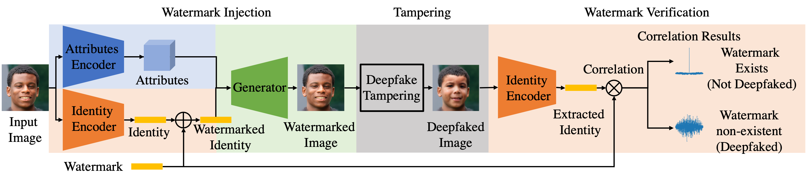

# Watermarking_In_FaceID

Official implementation of our "Watermarking Face image's identity to defence Deepfake abuse" paper for both training and evaluation.


## Abstract 
> The explosive progress of Deepfake techniques poses unprecedented privacy and security risks to our society by creating real-looking but fake visual content.
The current Deepfake detection studies are still in their infancy because they mainly rely on capturing artifacts left by a Deepfake synthesis process as detection clues, which can be easily removed by various distortions (e.g. blurring) or advanced Deepfake techniques.
In this paper, we propose a novel method that does not depend on identifying the artifacts but resorts to the mechanism of anti-counterfeit labels to protect face images from malicious Deepfake tampering. 
Specifically, we design a neural network with an encoder-decoder structure to embed watermarks as anti-Deepfake labels into the facial identity features.
The injected label is entangled with the facial identity feature, so it will be sensitive to face swap translations (i.e., Deepfake) and robust to conventional image modifications (e.g., resize and compress). 
Therefore, we can identify whether watermarked images have been tampered with by Deepfake methods according to the label's existence.
Experimental results demonstrate that our method can achieve average detection accuracy of more than 80\%, which validates the proposed method's effectiveness in implementing Deepfake detection.

<p align="center">

<br>
The proposed Face Identity Watermarking framework can be used to invisibly embed user-generated or pseudo-random sequences into target face images' identity feature to defence malicious Deepfake.
</p>


## Prerequisites
- Linux or macOS
- NVIDIA GPU + CUDA CuDNN (CPU may be possible with some modifications, but is not inherently supported)
- Python 3


## Training Framework
### Preparation
Please download datasets and unzip images into a folder for training. 
- We experiment on three datasets (you can choose one of them as the training set and another one as the validation set).
  - [CelebA aligned and cropped images (Celeba)](https://drive.google.com/drive/folders/0B7EVK8r0v71pTUZsaXdaSnZBZzg?resourcekey=0-rJlzl934LzC-Xp28GeIBzQ).
  - [Celeba-HQ](https://drive.google.com/drive/folders/0B4qLcYyJmiz0TXY1NG02bzZVRGs?resourcekey=0-arAVTUfW9KRhN-irJchVKQ)
  - [Flickr-Faces-HQ Dataset (FFHQ)](https://drive.google.com/drive/folders/1u2xu7bSrWxrbUxk-dT-UvEJq8IjdmNTP).

Please download pre-trained identity encoder models for training. 
- The framework requires pre-trained identity encoder networks in training (You can choose one of them from below, save its pre-trained model in the folder `pretrained_models` and then set the corresponding argument in common line: `facenet_mode`).
  - [ArcFace](https://drive.google.com/drive/folders/0B7EVK8r0v71pTUZsaXdaSnZBZzg?resourcekey=0-rJlzl934LzC-Xp28GeIBzQ).
  - [CurricularFace](https://drive.google.com/drive/folders/0B4qLcYyJmiz0TXY1NG02bzZVRGs?resourcekey=0-arAVTUfW9KRhN-irJchVKQ)


### Running, e.g.,
  ```
  python scripts/training.py \
  --facenet_mode=arcface \
  --facenet_dir='./saved_models' \
  --exp_dir= /directory/to/output \
  --trainimg_dir= /directory/to/training images set \
  --valimg_dir= /directory/to/validation images set
  ```
  where
  - `facenet_mode` assigns the identity encoder's framework, must be one of [[ArcFace](https://arxiv.org/abs/1801.07698) | [CurricularFace](https://github.com/HuangYG123/CurricularFace)], and default is ArcFace.
  - `facenet_dir` indicates the directory contains the pre-trained model of the identity encoder.
  - `exp_dir` contains model snapshots, image snapshots, and log files.
  - `trainimg_dir` and `valimg_dir` point to the folders containing images for training and validation.


## Injection
### Preparation
Please download the required pre-trained models from [here](https://drive.google.com/drive/folders/1OiH9SsQErCoFA8fOjf7zbDNIJM1GMi_Q?usp=sharing) and save these models to the directory `pretrained_models`.

| Model | Description
| :--- | :----------
| Identity Encoder | Pre-trained face recognition network extracts the input image's last feature vector generated before the final fully-connected layer as identity representation.
| Attributes Encoder | U-Net style network uses the feature maps generated from the U-net decoder parts to represent the input face images' attributes.
| AAD Generator | The image reconstruction network adopts multiply cascaded [AAD Residual Blocks (ResBlk)](https://arxiv.org/abs/1912.13457) to integrate the identity and attributes.
| Multi-Scale Discriminator | Network taken from [phillipi](https://github.com/phillipi/pix2pix) for adversarial training.


### Samples
Here we show some samples of Injection results.

<p align="center">

<br>
  Comparison between watermarked and non-watermarked images' Deepfake results
</p>

<p align="center">
  
<br>
  Watermarked images using different sequences.
</p>


### Running, e.g.,
  ```
  python scripts/inject_watermark.py \
  --rand_select=Yes \
  --max_num=1000 \
  --facenet_mode=arcface \
  --facenet_dir='./saved_models' \
  --aadblocks_dir='./pretrained_models' \
  --attencoder_dir='./pretrained_models' \
  --seq_type=gold \
  --exp_dir= /directory/to/output \
  --img_dir=/directory/to/images \
  ```
  where
  - `rand_select` indicates whether random select images for embedding.
  - `max_num` indicates the number of images to be embedded.
  - `facenet_mode` and `facenet_dir` must be consistent with pre-trained models, e.g., if you download ArcFace's pre-trained mode, you must assign the `facenet_mode` as `arcface` and assign the `facenet_dir` to corresponding pre-trained model.
  - `facenet_dir` indicates the directory contains the pre-trained model of the identity encoder.
  - `aadblocks_dir` indicates the directory contains the pre-trained model of the identity encoder.
  - `attencoder_dir` indicates the directory contains the pre-trained model of the identity encoder.
  - `seq_type` indicates the type of sequence you want to embed in images.
  - `exp_dir` contains model snapshots, image snapshots, and log files.
  - `img_dir` contains images to be embedded.


## Anaylsis, Evaluation and Extraction
### Preparation
Please follow the introduction in the Injection section to download and save the required pre-trained models.


### Running, e.g.,
- If you want to analyse the correlation between the embedded and original sequence, run: **analysis**, e.g.,
  ```
  python scripts/analysis.py \
  --perturbation=No \
  --visual_correlation=Yes \
  --peak_threshold=5 \
  --seq_dir=/directory/to/saved sequence .txt file \
  --img_dir=/directory/to/images \
  --facenet_mode=arcface \
  --facenet_dir='./pretrained_models' 
  ```
  where
  - `perturbation` whether apply perturbation on input images to implement robustness test.
  - `visual_correlation` whether visualize the correlation clurve.
  - `peak_threshold` indicates the decision threshold to determine whether the image contains a watermark. 
  - `seq_dir` points to the directory that contains the sequence .txt file.
  - `img_dir` contains images to be detected whether they contain the watermark.


- If you want to conduct Deepfake detection among Deepfaked images and authentic images, run **evaluation**, e.g.,
  ```
  python scripts/evaluation.py \
  --peak_threshold=5 \
  --seq_dir=/directory/to/saved sequence .txt file \
  --facenet_mode=arcface \
  --facenet_dir='./saved_models' \
  --imgpos_dir=/directory/to/positive(real) images' \
  --imgneg_dir=/directory/to/negative(fake) images' 
  ```
  where
  - `imgpos_dir` contains real images.
  - `imgneg_dir` contains the Deepfake images.


- If you want to detect the watermark in images, run: **extraction**, e.g.,
  ```
  python scripts/extraction.py \
  --peak_threshold=5 \
  --perturbation=No \
  --seq_dir=/directory/to/saved sequence .txt file \
  --img_dir=/directory/to/images \
  --facenet_mode=arcface \
  --facenet_dir='./pretrained_models' 
  ```
  where
  - `peak_threshold` indicates the decision threshold to determine whether the image contains a watermark. 
  - `perturbation` whether apply perturbation on input images to implement robustness test.
  - `seq_dir` points to the directory that contains the sequence .txt file.
  - `img_dir` contains images to be detected whether they contain the watermark.


 


## Citation
If you think this code is useful or employ it in your research, please cite our paper:

```
@article{zhao2021private,
  title={Private-encoder: Enforcing privacy in latent space for human face images},
  author={Zhao, Yuan and Liu, Bo and Zhu, Tianqing and Ding, Ming and Zhou, Wanlei},
  journal={Concurrency and Computation: Practice and Experience},
  pages={e6548},
  year={2021},
  publisher={Wiley Online Library}
}
```
